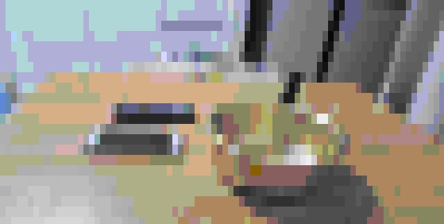

# image captioning

keras/tensorflow image captioning application using CNN and transformer as encoder/decoder. 
In particulary, the architecture consists of three models:

model|description
---|---
CNN|used to extract the image features. In this application, it used EfficientNetB0 pre-trained on imagenet.
TransformerEncoder|the extracted image features are then passed to a transformer encoder  that generates a new representation of the inputs.
TransformerDecoder|it takes the encoder output and the text data sequence as inputs and tries to learn to generate the caption. 

(reference github) https://github.com/Dantekk/image-captioning

---
1. [Progress](#Progress)
2. [Installation](#Installation)
3. [Dataset](#Dataset) 
4. [Training](#Training)
5. [Evaluate](#Evaluate)
6. [Inference](#Inference)
7. [Result](#Result)
8. [Comparison](#Comparison)
---

## Progress
- [x] guide for project setup
- [x] uploading pretrained model and format-compatible datasets.
- [x] guide for model training
- [x] guide for model evaluation with pretrained model
- [x] guide for model inferencing example

---
## installation
### - github download

~~~console
$ git clone https://github.com/pushdown99/captioning.git
$ cd captioning
$ ls (or tree -d -L 2)

├── dataset
├── docker
├── lib
│   ├── model
│   └── __pycache__
├── output
└── sample
~~~
### - venv 

Read [INSTALL.md](INSTALL.md)

~~~console
$ python -m venv tf2
$ source tf2/bin/activate
$ pyenv install 3.9.10
$ python -m pip install --upgrade pip
$ pip install tensorflow colorama easydict
$ pip install tqdm ipykernel nltk
$ python -m ipykernel install --user --name tf2 --display-name "tf2"
$ pip install ipdb matplotlib pandas climage fire
~~~

### - docker

for the runtime nvidia-docker environment installation  
read [NVIDIA-DOCKER-INSTALL](NVIDIA-DOCKER-INSTALL.md)
~~~console
$ ./docker.sh run
~~~
or 
~~~console
$ sudo docker run --gpus all -it --rm --runtime=nvidias pushdown99/captioning bash
~~~

## - jupyter notebook

~~~console
$ ./jupyter.sh
~~~
or
~~~console
$ jupyter notebook --ip=0.0.0.0 --port=8000 --NotebookApp.iopub_data_rate_limit=1.0e10
~~~
---
## Dataset
The model has been trained on train/val NIA dataset. You can download the dataset here. Note that test images are not required for this code to work.

dataset/c_train.json
dataset/c_val.json

Each element in the train.json file has such a structure :
"images/IMG_0061865_(...).jpg": ["caption1", "caption2", "caption3", "caption4", ..."caption10"], ...

In same way in the val.json :
"images/IMG_0061865_(...).jpg": ["caption1", "caption2", "caption3", "caption4", ..."caption10"], ...

pretrained model and cleasing dataset here. [nia](https://drive.google.com/drive/folders/1IDOSzoIjo5dsJ-KgR3mMwUXaHKo2MGJJ?usp=sharing)

tarball|descriptions
---|---
captioning.dataset.tare.gz|cleansing dataset
captioning.model.tare.gz|pretrained model

~~~console
$ mkdir dataset
$ cd dataset
$ tar xvfz captioning.dataset.tare.gz
$ cd ..
$ mkdir model
$ cd model
$ tar xvfz captioning.model.tare.gz
~~~

### - dependencies
I have used the following versions for code work:

code work|version
---|---
python|3.8.10
tensorflow|2.11.0
cuda|11.2
cudnn|8
numpy|1.23.1

### - setting

~~~console
$ cat lib/config.py
~~~

~~~python

num_gpus    = len(tf.config.list_physical_devices('GPU'))
num_workers = num_gpus * 4

class Config:
    data = 'nia'
    data_dir = 'dataset/NIA/'
    captions = join(data_dir, 'captions.json')
    trainval = join(data_dir, 'c_trainval.json')
    train    = join(data_dir, 'c_train.json')
    val      = join(data_dir, 'c_val.json')
    test     = join(data_dir, 'c_test.json')
    text     = join(data_dir, 'c_text.json')
    tokenize = join(data_dir, 'tokenize.pkl')
    trained = ''
    sample= ''

    model = 'efficientnetb0'
    epoch = 20
    n_caption = 10 #

    num_workers      = num_workers
    test_num_workers = num_workers

    IMAGE_SHAPE    = (299,299)
    MAX_VOCAB_SIZE = 2000000
    SEQ_LENGTH     = 25
    BATCH_SIZE     = 64
    SHUFFLE_DIM    = 512
    EMBED_DIM      = 512
    FF_DIM         = 1024
    NUM_HEADS      = 6

    def _parse(self, kwargs):
        state_dict = self._state_dict()
        for k, v in kwargs.items():
            if k not in state_dict:
                raise ValueError('UnKnown Option: "--%s"' % k)
            setattr(self, k, v)

        print('======user config========')
        pprint(self._state_dict())
        print('==========end============')

    def _state_dict(self):
        return {k: getattr(self, k) for k, _ in Config.__dict__.items() \
                if not k.startswith('_')}

opt = Config()
~~~

---

## Training
To train the model you need to follow the following steps :

you have to make sure that the training and valid set images are in the folder NIA_dataset/images/ 
you have to enter all the parameters necessary for the training in the config.py file.
start the model training with python run.py train

~~~console
$ source tf2/bin/activate
$ cp lib/config.nia lib/config.py
$ python run.py train --data=nia
~~~

~~~console
$ source tf2/bin/activate
$ nohup python run.py train --data=nia > train.nia.out &
$ tail -f train.nia.out
~~~
---
## Evaluate
To evaluate the model you need to follow the following steps :

~~~console
$ source tf2/bin/activate
$ nohup python run.py eval --data=nia > eval.nia.out &
$ tail -f eval.nia.out
~~~
---
## Inference
To inference the model you need to follow the following steps :

~~~console
$ source tf2/bin/activate
$ nohup python run.py inference --data=nia --sample={sample image}
$ python run.py inference --sample='sample/IMG_0047936_cell_phone.jpg'
Prediction:  휴대폰 이 나무 테이블 위 에 있다
~~~

original image:

---
## Result
When you evaluate model with a cleansing dataset,
then show this results.

bleu|result
---|---
BLEU-1|75.91 %
BLEU-2|62.23 %
BLEU-3|50.18 %
BLEU-4|36.37 %

read [dataset/scores.json](dataset/scores.json)
~~~python
[
  {
    "path": "images/IMG_0047936_cell_phone(cell_phone).jpg",
    "bleu1": 86.68778997501818,                                                                                                                                                                                                                                                                                          
    "predicted": "휴대폰 이 나무 테이블 위 에 있다",
    "actual": [
      "휴대폰 두 개 가 방 안 테이블 위 에 놓여 있다",
      "휴대폰 두 개 와 주전자 가 테이블 위 에 놓여 있다",
      "휴대폰 들이 나무 테이블 위 에 주전자 와 함께 놓여 있다",
      "하얀색 휴대폰 는 검정색 휴대폰 옆 에 놓여 있다",
      "두 개 의 휴대폰 이 놓인 테이블 은 하얀색 싱크대 앞 에 놓여 있다",
      "휴대폰 들 옆 에는 검정색 문 이 달린 노란색 주전자 가 놓여 있다",
      "휴대폰 들은 액정 화면 을 위 로 향하도록 놓여 있다",
      "휴대폰 들이 놓인 테이블 은 나무 로 만들어졌다",
      "주전자 가 놓인 테이블 은 그 위 에 휴대폰 두 개 가 놓여 있다",
      "하얀색 휴대폰 는 검정색 케이스 가 끼어져 있다"
    ]
  },
  {
    "path": "images/IMG_0183807_cell_phone(cell_phone).jpg",
    "bleu1": 88.88888888888889,
    "predicted": "마우스 와 휴대폰 이 테이블 위 에 나란히 있다",
    "actual": [
      "휴대폰 두 개 가 테이블 위 에 있다",
      "흰색 휴대폰 는 마우스 주변 에 있다",
      "검은색 휴대폰 는 마우스 왼 쪽 에 있다",
      "휴대폰 는 테이블 이 있는 방 안 에 있다",
      "휴대폰 는 마우스 가 올려 진 테이블 에 올려 져 있다",
      "휴대폰 이 올려 진 테이블 은 원목 무늬 이다",
      "휴대폰 와 마우스 는 테이블 위 에 올려 져 있다",
      "흰색 휴대폰 는 검은색 휴대폰 왼 쪽 에 있다",
      "휴대폰 두 개 와 마우스 는 함께 테이블 위 에 올려 져 있다",
      "검은색 휴대폰 는 흰색 휴대폰 와 마우스 사이 에 있다"
    ]
  },
  {
    "path": "images/IMG_1444057_sweet_potato(sweet_potato).jpg",
    "bleu1": 71.65313105737893,
    "predicted": "고구마 가 테이블 위 에 있다",
    "actual": [
      "바나나 와 함께 그릇 에 있는 고구마 는 상자 주변 에 있다",
      "그릇 위 고구마 와 바나나 는 흰색 바탕 에 붙여져 있다",
~~~

---
## Comparison

